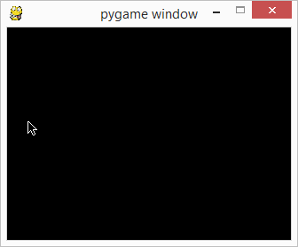

Installing Pygame
=================

 

Head to the pygame website, download the setup file for your OS version and
install it.

 

Initializing Pygame
===================

 

Create a new Python file called ‘**game\_of\_life**’ and put the following code
in:

~~~~~~~~~~~~~~~~~~~~~~~~~~~~~~~~~~~~~~~~~~~~~~~~~~~~~~~~~~~~~~~~~~~~~~~~~~~~~~~~
import sys
 
import pygame
 
pygame.init()
columns, rows = 50, 50
cell_size = 10
size = width, height = columns * cell_size, rows * cell_size
screen = pygame.display.set_mode(size)
 
while True:
    for event in pygame.event.get():
        if event.type == pygame.QUIT:
            sys.exit()
~~~~~~~~~~~~~~~~~~~~~~~~~~~~~~~~~~~~~~~~~~~~~~~~~~~~~~~~~~~~~~~~~~~~~~~~~~~~~~~~

 

**Line 1: **Import the sys module so that we can call **sys.exit** on line 12 to
end the game when the user quits. Without this, there won’t be any way of
exiting the game!

 

**Line 3:** Import pygame. Notice how our imports are organised – system modules
first, then 3rd party modules. This is generally the recommended way of ordering
them, and can be achieved automatically by pressing **ctrl + alt + o**, in the
same way that we can format code automatically by pressing **ctrl + alt + f**.

 

**Line 5:** Initialise the display – every PyGame program needs to call this
once at the beginning of the program.

 

**Lines 6-8:** We define the size of our world here – you can make it any size
you want. **cell\_size** is the number of pixels per cell – try changing this
and see what happens. Because pygame and most other libraries deal with width
and height in pixels rather than cells, we have to multiply the number of cells
by the **cell\_size** to convert to pixels.

 

**Line 10:** We use the size in pixels to initialise a screen. We’ll be using
this later to draw to.

 

**Line 11:** Our program is run in a continual loop, waiting for input.

 

**Lines 12 – 14:** **‘Events’** are placed in a queue and we can deal with them
here. Events could be keyboard or mouse input, or in this case the user clicking
on the window close button.

 

Run the program, and you should see a blank screen like this:

 

 

You can see what kind of events are generated by placing a print statement:

~~~~~~~~~~~~~~~~~~~~~~~~~~~~~~~~~~~~~~~~~~~~~~~~~~~~~~~~~~~~~~~~~~~~~~~~~~~~~~~~
for event in pygame.event.get():
        print event
~~~~~~~~~~~~~~~~~~~~~~~~~~~~~~~~~~~~~~~~~~~~~~~~~~~~~~~~~~~~~~~~~~~~~~~~~~~~~~~~

 

Now, when you press a key or use the mouse, you will see the event in the
console:

~~~~~~~~~~~~~~~~~~~~~~~~~~~~~~~~~~~~~~~~~~~~~~~~~~~~~~~~~~~~~~~~~~~~~~~~~~~~~~~~
<Event(4-MouseMotion {'buttons': (0, 0, 0), 'pos': (980, 3), 'rel': (6, 0)})>
<Event(4-MouseMotion {'buttons': (0, 0, 0), 'pos': (984, 3), 'rel': (4, 0)})>
<Event(4-MouseMotion {'buttons': (0, 0, 0), 'pos': (989, 3), 'rel': (5, 0)})>
<Event(4-MouseMotion {'buttons': (0, 0, 0), 'pos': (992, 5), 'rel': (3, 2)})>
<Event(4-MouseMotion {'buttons': (0, 0, 0), 'pos': (995, 5), 'rel': (3, 0)})>
<Event(4-MouseMotion {'buttons': (0, 0, 0), 'pos': (997, 5), 'rel': (2, 0)})>
<Event(4-MouseMotion {'buttons': (0, 0, 0), 'pos': (999, 5), 'rel': (2, 0)})>
<Event(1-ActiveEvent {'state': 1, 'gain': 0})>
<Event(12-Quit {})>
~~~~~~~~~~~~~~~~~~~~~~~~~~~~~~~~~~~~~~~~~~~~~~~~~~~~~~~~~~~~~~~~~~~~~~~~~~~~~~~~

 

### NOTE:

Because the main loop is running potentially thousands of times a second, it’s
not advisable to put lots of print statements there.

 

Pygame functionality is organised into the following modules:

 

| cdrom     | manage cdrom devices and audio playback       |
|-----------|-----------------------------------------------|
| cursors   | load cursor images, includes standard cursors |
| display   | control the display window or screen          |
| draw      | draw simple shapes onto a Surface             |
| event     | manage events and the event queue             |
| font      | create and render Truetype fonts              |
| image     | save and load images                          |
| joystick  | manage joystick devices                       |
| key       | manage the keyboard                           |
| mouse     | manage the mouse                              |
| movie     | playback of mpeg movies                       |
| sndarray  | manipulate sounds with Numeric                |
| surfarray | manipulate images with Numeric                |
| time      | control timing                                |
| transform | scale, rotate, and flip images                |

 

We’ll mostly be using the draw and event modules.
